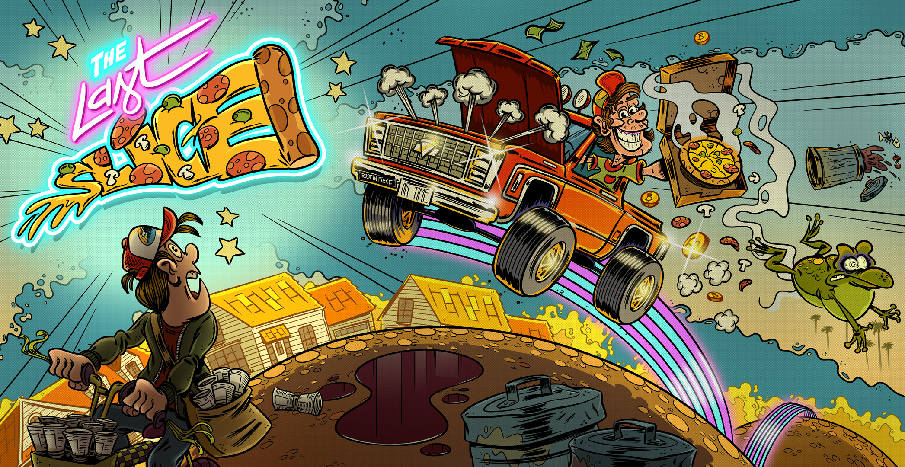
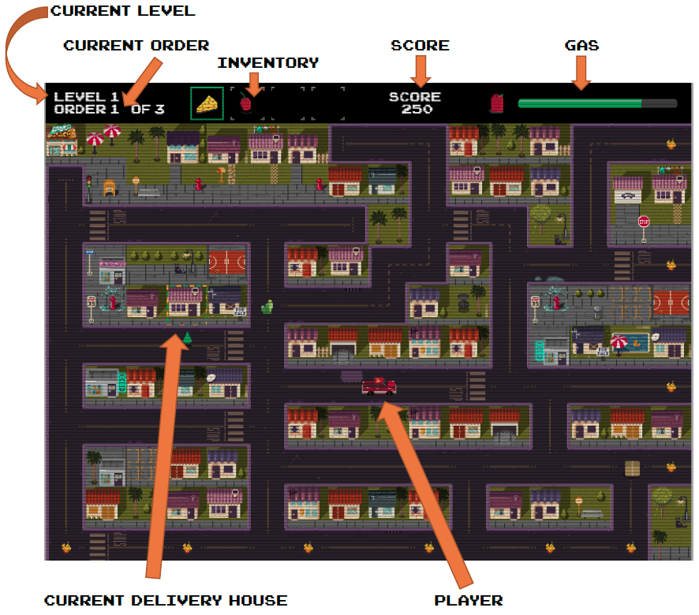
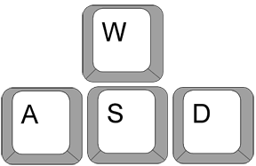
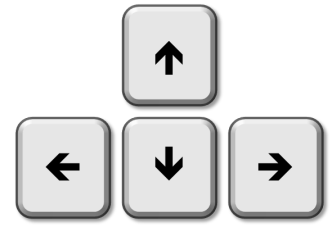
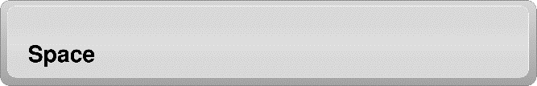
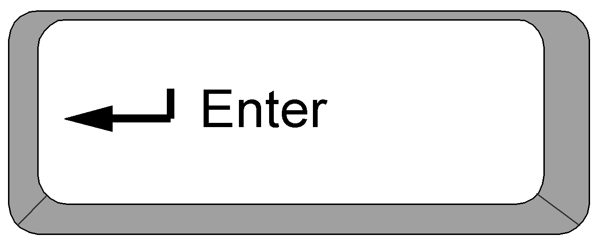

# Challenge 1

This is the first of three challenges for The Last Slice: A retro 8-bit video game that's currently impossible to beat. Clone or download the code, install the prerequisites on your Windows 10 PC, open TheLastSlice.sln file with Visual Studio and run the game. You have the source code...change it any way you'd like to beat the game.

## The Prerequisites

Here's what you'll need to get started:

 * A Windows 10 PC
 * Install [Visual Studio 2017](http://bit.ly/LastSliceVS)
 * Install [MonoGame 3.6](http://bit.ly/Mono36)
 * Install [Visual C++ Redistributable for Visual Studio 2012 Update 4](http://bit.ly/LastSliceRedist)
 
After installing the prerequisites find and open TheLastSlice.sln file with Visual Studio, and run the game.

## The Problem

The Last Slice retro video game is fun to play, but impossible to beat as coded. You won’t beat this challenge with just gamer skills. Break out your development skills, change the code and find a way to win the game. The possibilities are endless, and you have the source code...so what’s next is up to you.

## The Reward

Solving this challenge gives you instant access to [challenge 2](https://github.com/KneadMoreDough/KneadMoreDough), and you'll be one step closer to being one of five lucky participants that could win $10,000 USD.

But hurry - to be eligible to compete in the third and final challenge, you'll need to solve both this challenge and challenge 2 before midnight UTC on July 17, 2018.

## Game Story and Controls

You are the world’s greatest pizza delivery person. Anywhere pizza is needed, you are there! When an order comes in, drive your pizza delivery truck to collect the correct ingredients scattered across the map. With the ingredients added to your inventory, deliver the order to the marked house on the map.

 * Beware: Only deliver the correct ingredients or you’ll be fired!
 * Keep an eye on your gas tank!
 * Avoid the pesky paper boy!
 * Fire = bad!

<strong>WASD or Arrows navigate game menus and control the pizza delivery truck:</strong>

<strong>Spacebar or Enter to select a menu option or deliver a pizza to the highlighted house:</strong>

## Back Story

You may have heard of the [Bitcoin pizza legend](https://medium.com/windows-developer/deliver-the-famous-bitcoin-pizza-in-this-retro-video-game-challenge-get-a-10-000-tip-3796d6ca5b2f). One fateful spring afternoon in 2010, Laszlo Hanyecz paid for two hot and delicious pizzas via Bitcoin, and the first official Bitcoin purchase was written into history. Little did he know that his actions were the first in a whirlwind trend that ultimately resulted in the valuation of those two pizzas ringing up at $100,000,000 at the peak of Bitcoin valuation.

Thus, Bitcoin Pizza Day was born. A day still celebrated each May 22nd amongst blockchain enthusiasts, financial speculators and anybody that has an interest in internet mythology. But has anyone spared a thought for the delivery person who carried those two cheesy, melty pies to Hanyecz’s door? If not for that delivery person, Bitcoin Pizza Day may have never been engraved in internet legend, and then who knows what course the universe would have taken. What did they get out of it? Was there even a tip?

Well, a team at Windows has been pondering that question, and they’ve come up with a proper, internet-wide homage to honor the Bitcoin pizza delivery person. It’s called The Last Slice. The first five players to complete all three challenges will get a pizza delivery 'tip' that today is worth $10,000 USD. Yes - that's $10,000, deposited into the Bitcoin exchange or bank of your choice, paid to you by Windows.

But be warned, this game is no Sunday drive. Who will nab the last slice?

## License

Copyright (c) Microsoft Corporation. All rights reserved.

Licensed under the [MIT](LICENSE.txt) License.
